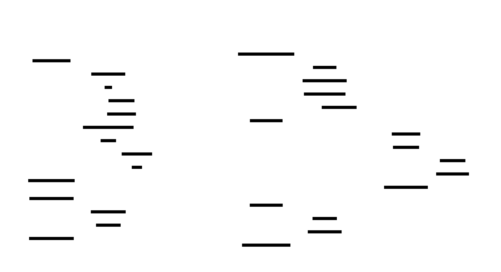

# ADR 0006：让订单创建、确认与终态处理在重放下保持幂等安全

- 状态：Accepted
- 日期：2026-06-06

## 背景

[flashsale issue #5](https://github.com/jingyi-zhao-01/flashsale/issues/5) 的 Milestone 1
要求我们把订单状态迁移和幂等语义写清楚，并且让这些行为在 replay 场景下可测试、可解释、不会破坏库存或订单结果。

当前 flashsale 架构其实已经具备了不少基础能力：

- `orders.idempotency_key` 已存在
- `orders_idempotency_key_idx` 对非空 key 提供唯一约束
- `CreateOrderUseCase` 会在 reserve 之前先检查是否已存在同 key 订单
- `OrderPostgresRepository` 和 `OrderPostgresUnitOfWork` 在写入时也会用
  `INSERT ... ON CONFLICT DO NOTHING` 再挡一次重复写
- 订单状态与支付状态的合法迁移，已经由
  `order-service/app/domain/state_machines.py` 显式约束
- reservation terminalization 已经移出同步 `/orders` 路径，并通过 durable 的
  `order_terminalization_tasks` 来驱动

但这些能力如果不写成明确的架构契约，在 code review、测试设计、事故复盘里还是很容易被误解。我们需要能稳定回答这些问题：

- 为什么重复的 `POST /orders` 不会创建第二个逻辑订单？
- 为什么重复的 payment webhook 不会把最终订单状态改坏？
- 如果 reserve 成功了，但 order 持久化失败，最终应该收敛到什么状态？
- 哪些状态迁移是合法的，哪些必须永远非法？

这份 ADR 的目的，就是把这些保证写成清晰的设计约束，作为 issue #5 后续实现和测试的依据。

## 决策

我们把 flashsale 里的 idempotency 定义为一种**状态收敛保证**，而不只是 cache 层的优化技巧。

核心规则是：

> 同一个逻辑购买意图可以被 retry、replay、重复观察很多次，但它最终只能收敛到一个持久化订单结果，以及一个库存结果。

这个规则同时作用在三层：

1. `POST /orders`
2. payment confirm / webhook 处理
3. reservation terminalization worker 的重试路径

## 设计

### 1. 订单创建以 `idempotency_key` 为外部幂等边界

`POST /orders` 使用 `idempotency_key` 来代表一次逻辑购买意图，并把它作为对外的 replay fence。

#### `idempotency_key` 的设计原则

`idempotency_key` 不应该表示“这张订单长什么样”，而应该表示“这一次下单意图”。

推荐约束：

- 每次用户真实点击一次下单，生成一个新的 key
- 同一次请求的 retry / replay，必须复用同一个 key
- 新的一次真实购买，即使商品和数量完全相同，也必须使用新的 key

推荐生成方式：

- 由客户端生成 `UUID` 或 `ULID`
- 服务端只负责校验、持久化、回放已有结果

不推荐的 key 设计：

- `user_id:product_id`
- `user_id:cart_hash`
- `product_id:timestamp_second`

这些设计的问题在于，它们会把本来合法的两次独立购买误判成同一次请求重放。

#### 相同 key 重放时的请求一致性

`idempotency_key` 的重放语义应该是：

- 同一个 key 可以被重复提交
- 但重复提交的请求，必须代表同一个业务意图

因此，服务端除了按 `idempotency_key` 查单外，还应该把这个 key 和以下信息一起绑定：

- `user_id`
- 请求 payload 的稳定摘要，例如 `payload_hash`

如果出现：

- key 相同
- 但 `user_id` 或 `payload_hash` 不同

系统不应把它当成合法 replay，而应返回冲突错误，例如 `409 idempotency key reused with different payload`。

当前 create path 有两层保护：

1. **先查再做**
   - `CreateOrderUseCase.create_order()` 在用户校验、admission gate、库存预留之前，先查 `get_by_idempotency_key()`
   - 如果订单已经存在，就直接返回已有订单，不再继续 reserve
2. **数据库写入唯一性保护**
   - 数据库对 `orders.idempotency_key` 维护唯一 partial index
   - 插入语句使用 `ON CONFLICT (idempotency_key) ... DO NOTHING`
   - 如果并发写入时别的请求先赢了，后到的请求会回读现有订单并返回

因此，重复的 `POST /orders` **绝不能**：

- 再扣一次库存
- 再创建一个新的逻辑订单
- 再插入第二条订单行

它唯一能做的事，是：

- 返回已经存在的那条订单

#### Cache 在这里的角色

cache 可以用来快速挡住同一个 `idempotency_key` 的 retry storm，但 cache 不是最终真相。

推荐的 cache 语义是：

- key: `idem:order:{idempotency_key}`
- value:
  - `status=processing|succeeded|failed`
  - `order_id`
  - `user_id`
  - `payload_hash`
  - `created_at`

典型流程：

1. 请求进入
2. 先查 cache / Redis 是否已有 `idempotency_key`
3. 若没有，用 `SET NX EX` 之类的方式占位成 `processing`
4. 占位成功后，才继续真正的 `create order`
5. 成功后，把结果写回 cache，例如 `status=succeeded, order_id=123`
6. 后续同 key replay，直接返回已有结果

这层的主要收益是：

- 减少重复请求反复打到数据库
- 在超时重试风暴下更快收敛
- 给“正在处理中”的请求一个明确的可见状态

#### 为什么 cache 不够，仍然必须保留数据库唯一约束

cache 只能做快速挡板，不能代替数据库层的最终正确性。

原因包括：

- cache 可能过期
- cache 可能丢失
- 多实例并发下，仍可能出现 cache 未命中但数据库已写入的竞态

因此，最终设计必须是两层：

1. cache / Redis 负责快速去重与快速返回
2. 数据库唯一约束负责最终兜底

也就是说，flashsale 的正确做法不是“只靠 idempotency cache”，而是：

> Redis 帮你更快地不重复做事，Postgres 保证你最终不可能重复落单。

#### TTL 语义

cache 上的 `idempotency_key` 应该有 TTL，但 TTL 只影响快速回放能力，不影响长期正确性。

推荐理解是：

- 较短 TTL，例如 `5m` 到 `30m`，足以覆盖客户端超时重试窗口
- 即使 cache TTL 过期，数据库里的 `idempotency_key` 唯一约束仍然要继续保证不会重复创建订单

因此：

- cache TTL 是性能与用户体验参数
- 数据库唯一约束才是 correctness contract

### 2. reserve 成功但订单持久化失败时，必须立即补偿

库存预留不能变成孤儿副作用。

如果 `product-service reserve` 已经成功，但订单行无法持久化，那么系统必须把这次 create attempt 已拿到的所有 reservation id 立即释放掉。

这个失败场景的最终状态应该是：

- 没有新的 durable order row
- `product-service` 里的 reservation 被 release 或 cancel
- 库存被归还
- 调用方收到失败响应

这个原则独立于失败原因本身。无论失败来自：

- order insert 失败
- task enqueue 失败
- reserve 之后出现的瞬时数据库异常

这次 milestone 的补偿规则都是：

> 只要没有 durable order，就不能留下 durable inventory hold。

### 3. 订单状态迁移必须是显式且封闭的

合法的订单状态迁移如下：

| 当前状态 | 允许迁移到 |
|---|---|
| `pending` | `confirmed`、`failed`、`cancelled`、`expired` |
| `confirmed` | `confirmed` |
| `failed` | `failed` |
| `cancelled` | `cancelled` |
| `expired` | `expired` |

合法的支付状态迁移如下：

| 当前状态 | 允许迁移到 |
|---|---|
| `pending` | `succeeded`、`cancelled` |
| `succeeded` | `succeeded` |
| `cancelled` | `cancelled` |

除此之外的迁移都属于非法迁移，必须快速失败。

必须始终保持非法的例子包括：

- `confirmed -> cancelled`
- `expired -> confirmed`
- `cancelled -> confirmed`
- `succeeded -> cancelled`

终态上的自环迁移是允许的，因为 replay 之后应该是 no-op，而不是制造新的业务变化。

### 4. 支付确认当前采用“按订单状态收敛”的幂等语义

`POST /payments/webhook` 在接收到重复的支付成功信号时，必须保证结果安全。

当前决策规则是：

- 如果订单已经是 `confirmed / succeeded`，直接返回现有订单，不再做任何额外动作
- 如果订单已经进入非成功终态，比如 `expired`、`failed`、`cancelled`，也直接返回现有订单，不允许 revive
- 如果订单仍然是 `pending`，只允许它朝成功方向推进一次，并 enqueue 必要的 reservation confirm 工作

也就是说，这一阶段 webhook replay-safe 的依据是**当前 order state**，而不是一张单独的 “processed webhook events” 去重账本。

这对当前本地环境和 compose 环境已经够用，因为：

- 当前 payment path 更像内部成功信号，不是第三方的 at-least-once event stream
- 终态是显式的，而且终态只允许自环 replay，不允许被重新推进成别的状态
- 第一次成功之后，重复 webhook 会自然塌缩成 read-only no-op

如果未来 flashsale 真接入 Stripe、Adyen、PayPal 这类外部支付系统，那么应该追加一层按 provider `event_id` 去重的持久化事件账本。但那是后续增强项，不是完成 issue #5 当前目标的前置条件。

### 5. Terminalization 重试必须保证结果幂等

`order_terminalization_tasks` 是 confirm / cancel 路径上的 durable retry boundary。

worker 这层必须满足：

- 同一个逻辑 confirm 被重试时，不能 double-confirm 库存
- 同一个逻辑 cancel 被重试时，不能 double-release 库存
- 在订单已经收敛之后再 replay 任务，也不能把最终订单结果改坏

这一阶段我们把 worker replay-safe 看成以下几项能力的组合：

- durable task row
- `order_terminalization_task_events` 里的 attempt history
- 下游 confirm / cancel 语义本身要支持幂等
- 对已经终态的订单，状态更新必须退化成 no-op

换句话说，worker 可以多次看到同一个业务意图，但只有第一次成功执行，才允许真正改变 durable outcome。

## 端到端不变量

以下是不变量，也是这份 ADR 规定的最终契约。

### 不变量 A：一个 `idempotency_key` 只能映射一个逻辑订单

同一个 `idempotency_key` 可以被多次查询、多次 replay、多次返回，但不能创建两个不同的 `order_id`。

### 不变量 B：库存消费只能产生一次业务效果

对于同一个逻辑购买意图：

- stock 最多 reserve 一次
- stock 最多 confirm 一次
- stock 最多 release 一次

Replay 可以再次检查这些操作，但不能让库存第二次被扣减或第二次被释放。

### 不变量 C：终态不能被 revive

一旦订单进入终态，后到的或重复的成功信号都不能把它重新拉回另一种状态。

### 不变量 D：后台重试不能破坏用户已经看到的结果

如果调用方已经观察到一个收敛后的订单结果，那么之后的 worker replay 必须保持这个结果不变。

## 关键失败路径的最终收敛状态

| 场景 | 最终订单状态 | 最终库存状态 |
|---|---|---|
| create 成功，后续 confirm 成功 | `confirmed / succeeded` | reservation `confirmed` |
| create 成功，但订单在支付前过期 | `expired / cancelled` | reservation `cancelled` |
| 订单过期后，晚到的 payment 成功再进入 | 保持 `expired / cancelled` | 保持 `cancelled` |
| reserve 成功，但 order persist 失败 | 没有 durable order | reservation released / cancelled |
| 同一个 key 的 `POST /orders` 重复提交 | 返回同一订单 | 不发生第二次 reserve |
| 确认成功后重复 payment success | 返回同一订单 | 不发生第二次 confirm |
| confirm 已成功后 worker 又 retry | 订单保持原终态 | 不发生 double confirm |

## 影响

收益：

- issue #5 现在有了明确的架构契约，而不只是模糊的测试目标
- 订单 replay 行为在事故复盘时可以被清楚解释
- API、worker、repository 都能共享同一套合法迁移边界
- reserve 成功但持久化失败后的补偿要求，被提升成了 correctness contract

代价与权衡：

- `idempotency_key` 现在正式成为对外 correctness contract 的一部分
- 当前 payment replay-safe 依赖的是状态收敛，而不是单独的 provider event dedupe ledger
- worker replay-safe 的可靠性，仍依赖下游 confirm / cancel 语义未来继续保持幂等

## 验证计划

只有在下面这些点都被测试或 harness 覆盖后，这个 milestone 才算完成：

- 同一个 `idempotency_key` replay 三次，只出现一个逻辑订单结果
- 同一个 payment success replay 三次，订单状态和库存都不漂移
- terminalization 处理 replay 三次，不发生 double confirm / double release
- 注入 `reserve succeeded but order persist failed`，验证补偿逻辑生效
- 显式断言下面这些非法迁移会失败：
  - `confirmed -> cancelled`
  - `expired -> confirmed`
  - `cancelled -> confirmed`

## 相关代码

- `application/flashsale/order-service/app/application/create_order_use_case.py`
- `application/flashsale/order-service/app/application/process_terminalization_task_use_case.py`
- `application/flashsale/order-service/app/domain/state_machines.py`
- `application/flashsale/order-service/app/adapters/order_postgres_repository.py`
- `application/flashsale/order-service/app/adapters/order_postgres_unit_of_work.py`
- `application/flashsale/prisma/order.prisma`
- `application/flashsale/order-service/tests/unit/test_order_lifecycle.py`
- `application/flashsale/order-service/tests/integration/order_compose_integration.py`

## 图

这份 ADR 最合适的图是 **sequence diagram**，因为 issue #5 的核心不是静态结构，而是 replay 行为在不同边界上的收敛语义。

下图展示了：

- 第一次 create order
- duplicate create replay 的短路返回
- 第一次 payment confirm
- duplicate confirm replay 的短路返回

